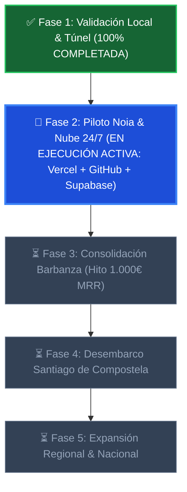

# 🗺️ ORGANIZACIÓN GENERAL — ROADMAP & TABLERO DE CONTROL
> **Departamento:** Organización General  
> **Rol:** Chief Operating Officer (COO) & Coordinación General  
> **Chat Asociado:** [`1dcc3fea-fde9-44f8-bb24-e0e2afd26f22`](conversation://1dcc3fea-fde9-44f8-bb24-e0e2afd26f22)  
> **Última Actualización:** 01 de Septiembre de 2026

---

## 🧭 Las 5 Fases de Despliegue Cronológico


```mermaid
flowchart TD
    F1["✅ Fase 1: Validación Local & Túnel (100% COMPLETADA)"]
    F1 --> F2["🚀 Fase 2: Piloto Noia & Nube 24/7 (EN EJECUCIÓN ACTIVA: Vercel + GitHub + Supabase)"]
    F2 --> F3["⏳ Fase 3: Consolidación Barbanza (Hito 1.000€ MRR)"]
    F3 --> F4["⏳ Fase 4: Desembarco Santiago de Compostela"]
    F4 --> F5["⏳ Fase 5: Expansión Regional & Nacional"]
    
    style F1 fill:#166534,stroke:#22c55e,stroke-width:2px,color:#ffffff
    style F2 fill:#1d4ed8,stroke:#3b82f6,stroke-width:3px,color:#ffffff
    style F3 fill:#334155,stroke:#64748b,stroke-width:1px,color:#94a3b8
    style F4 fill:#334155,stroke:#64748b,stroke-width:1px,color:#94a3b8
    style F5 fill:#334155,stroke:#64748b,stroke-width:1px,color:#94a3b8
```

---

## ☀️ Tablero Diario de Tareas (Standup de Estabilidad & Calidad — 04/10/2026)
> **Directiva Ejecutiva de la Startup:** Prioridad operativa absoluta: **Fixear Fluxo en su totalidad**. Toda expansión comercial o nuevas funcionalidades quedan en segundo plano hasta certificar estabilidad punta a punta, eliminación de fallos silenciosos y tolerancia cero a datos ficticios en memoria.  
> 🔔 **RECORDATORIO PENDIENTE EN VERCEL:** En Vercel (`Project Settings -> Environment Variables`), actualizar la variable `LEAD_NOTIFICATION_EMAIL` a `contactofluxosystem@gmail.com` para que los leads de la landing page en producción lleguen a la cuenta nueva.

```text
┌─────────────────────────────────────────────────────────────────────────┐
│ 🌅 DESPACHO TÉCNICO DIARIO — PRIORIDAD ABSOLUTA (04/10/2026)            │
│    Objetivo General: Fixear Fluxo en su Totalidad & Cero Datos Fantasma │
└────────────────────────────────────┬────────────────────────────────────┘
                                     │
┌────────────────────────────────────▼────────────────────────────────────┐
│ 🏛️ 1. ORGANIZACIÓN GENERAL (COO / Coordinación General)                 │
│  ├─ [x] Registro DEC-25: Erradicación Total de Eventos Ficticios        │
│  ├─ [x] Sincronización de acuerdos técnicos Guillermo F. Gómez & Nacho   │
│  ├─ [x] Actualización de prioridades: Standby en Menú del Día y Ventas │
│  └─ [x] Adopción de metodología Spec-Driven Development & Git Branching │
└────────────────────────────────────┬────────────────────────────────────┘
                                     │
┌────────────────────────────────────▼────────────────────────────────────┐
│ 📈 2. MARKETING & VENTAS (Captación & Go-to-Market)                     │
│  ├─ [x] Plantilla Carta Fija A4 completada y aprobada (PDF 386 KB)      │
│  ├─ [x] Resumen ejecutivo de 2 páginas validado                         │
│  ├─ [⏳ EN CURSO] Prospección activa Cliente #1 en Noia (Piloto 14 Días) │
│  └─ [⏳ EN CURSO] Preparación de pitch de cierre e Informe Día 14       │
└────────────────────────────────────┬────────────────────────────────────┘
                                     │
┌────────────────────────────────────▼────────────────────────────────────┐
│ 🎨 3. DISEÑO DE MARCA & UI/UX (Identidad & Ergonomía Visual)            │
│  ├─ [x] Modal de error de red con opción clara de reintento para cliente│
│  ├─ [x] Isotipo invertido oficial de Fluxo en documentos PDF            │
│  ├─ [x] Notificación persistente en mesa de servicio pedido (Punto 8)   │
│  └─ [⏳ EN CURSO] Kit Físico Piloto: Artes finales de peanas QR A5,     │
│       chuleta adhesiva de barra y cartas impresas para el local real    │
└────────────────────────────────────┬────────────────────────────────────┘
                                     │
┌────────────────────────────────────▼────────────────────────────────────┐
│ ⚙️ 4. INGENIERÍA & PRODUCTO — [PROGRAM DATA] (Desarrollo & Software)    │
│  ├─ [x] Punto 8: Notificación persistente de servicio en mesa funcional │
│  ├─ [x] Punto 5: Alérgenos UE (Reglamento 1169/2011) en catálogo/admin  │
│  ├─ [x] Punto 4: Cláusula de exención fiscal Veri*Factu / Ley Antifraude│
│  ├─ [⏳ En Curso] Punto 7: Pulir detalles del Admin de Cartas In Situ   │
│  ├─ [⏳ En Curso] Punto 6: Mantenimiento y validación continua flujo E2E│
│  ├─ [📋 Pendiente #1 - Crítico] Ejecutar migraciones en Supabase Cloud  │
│  │     (catálogo canónico, stock RLS y clave foránea de llamadas)       │
│  ├─ [x] Punto 2: Aislamiento de secretos y chequeo Vercel certificado   │
│  ├─ [📋 Pendiente #3.1] LSSI-CE: Datos fiscales del titular en /legal   │
│  ├─ [x] Punto 3.2: Correo contactofluxosystem@gmail.com configurado     │
│  │     (enlace activo en LEAD_NOTIFICATION_EMAIL y página legal)        │
│  └─ [x] Certificación integral y refactorización modular SOLID (v1.2)   │
└────────────────────────────────────┬────────────────────────────────────┘
                                     │
┌────────────────────────────────────▼────────────────────────────────────┐
│ 🧠 5. LEARNING & INTELLIGENCE (Memoria Operativa & Buenas Prácticas)    │
│  ├─ [x] Metodología Spec-Driven: Asumir rol de arquitecto frente a IA   │
│  ├─ [x] Protocolo de depuración SQL: CAST a varchar en campos UUID      │
│  └─ [x] Uso de ramas independientes (git branch) para aislar desarrollo │
└─────────────────────────────────────────────────────────────────────────┘
```

---

## 🌳 Cuadro Vertical: Organigrama y Mapa Temático Interdepartamental


```mermaid
graph TD
    DIR["👑 DIRECCIÓN GENERAL & COO<br/><b>Chief Operating Officer</b><br/><i>Estrategia Global, Priorización & Roadmap</i>"]
    
    DIR --> D1["🏛️ DEPARTAMENTO 1: ORGANIZACIÓN GENERAL<br/><b>Coordinación, Gobernanza & Control</b>"]
    D1 --> T1["📋 <b>Temas Clave de Organización:</b><br/>1.1 🧭 Hoja de Ruta de 5 Fases de Despliegue<br/>1.2 📜 Registro de Decisiones Operativas (DEC-01 a DEC-15)<br/>1.3 🔄 Libro de Sincronización Interdepartamental<br/>1.4 📊 Control de Cuellos de Botella y Priorización"]
    
    T1 --> D2["📈 DEPARTAMENTO 2: MARKETING & VENTAS<br/><b>Go-to-Market, Pricing & Prospección B2B</b>"]
    D2 --> T2["💼 <b>Temas Clave de Marketing & Ventas:</b><br/>2.1 💰 Matriz de Precios (39€ / 69€ / 99€ / 139€)<br/>2.2 🎯 ICP: Terrazas (10-40 mesas) y Alta Rotación<br/>2.3 🚶 Metodología 60-15-10 (Objetivo: 1.000€ MRR)<br/>2.4 🧮 Calculadora de ROI (+1.000€/mes por rotación extra)<br/>2.5 📄 One-Pager Comercial y Argumentario Anti-Objeciones"]
    
    T2 --> D3["🎨 DEPARTAMENTO 3: DISEÑO DE MARCA & UI<br/><b>Identidad, Design System & Ergonomía UX</b>"]
    D3 --> T3["🎨 <b>Temas Clave de Diseño & UI:</b><br/>3.1 🏷️ Identidad de Marca Global 'Fluxo'<br/>3.2 🎨 Design System, Tokens de Color y Tipografía<br/>3.3 📱 Ergonomía PWA para Móvil de Sala (<3 clics)<br/>3.4 🖥️ KDS Industrial de Cocina (>70px, táctil para grasa)"]
    
    T3 --> D4["⚙️ DEPARTAMENTO 4: INGENIERÍA & PRODUCTO<br/><b>Arquitectura, Seguridad, Integración & QA</b>"]
    D4 --> T4["⚡ <b>Temas Clave de Ingeniería:</b><br/>4.1 🏗️ Next.js 14 App Router + Supabase Cloud<br/>4.2 🛡️ Filtro Mozo Gatekeeper ('pending_validation')<br/>4.3 🔒 Seguridad RLS SSR, Idempotencia SQL y bcrypt<br/>4.4 🖨️ Soporte Tiqueteras Térmicas ESC/POS<br/>4.5 ⭐ Google Review Booster & SEO Semántico"]
    
    T4 --> D5["🧠 DEPARTAMENTO 5: LEARNING & INTELLIGENCE<br/><b>Memoria Operativa, Auditoría Competitiva & IA</b>"]
    D5 --> T5["📚 <b>Temas Clave de Learning:</b><br/>5.1 🔬 Análisis de Competidores (Qamarero / QR Payments S.L.)<br/>5.2 🤖 Patrones Agénticos y Disciplina en Antigravity<br/>5.3 📖 Gestión del Conocimiento Interdepartamental<br/>5.4 🛡️ Guías de Mitigación de Fricción Técnica"]

    style DIR fill:#0f172a,stroke:#334155,stroke-width:2px,color:#ffffff
    style D1 fill:#0f766e,stroke:#115e59,stroke-width:2px,color:#ffffff
    style T1 fill:#f0fdfa,stroke:#0f766e,stroke-width:1px,color:#0f172a
    style D2 fill:#b45309,stroke:#92400e,stroke-width:2px,color:#ffffff
    style T2 fill:#fffbeb,stroke:#b45309,stroke-width:1px,color:#0f172a
    style D3 fill:#7e22ce,stroke:#6b21a8,stroke-width:2px,color:#ffffff
    style T3 fill:#faf5ff,stroke:#7e22ce,stroke-width:1px,color:#0f172a
    style D4 fill:#1d4ed8,stroke:#1e40af,stroke-width:2px,color:#ffffff
    style T4 fill:#eff6ff,stroke:#1d4ed8,stroke-width:1px,color:#0f172a
    style D5 fill:#047857,stroke:#065f46,stroke-width:2px,color:#ffffff
    style T5 fill:#ecfdf5,stroke:#047857,stroke-width:1px,color:#0f172a
```

### 📦 Cuadro de Flujo Jerárquico Vertical

```text
┌─────────────────────────────────────────────────────────────────────────┐
│ 👑 DIRECCIÓN GENERAL & COO (Chief Operating Officer)                    │
│    Coordinación Interdepartamental, Estrategia & Roadmap                │
└────────────────────────────────────┬────────────────────────────────────┘
                                     │
┌────────────────────────────────────▼────────────────────────────────────┐
│ 🏛️ DEPARTAMENTO 1: ORGANIZACIÓN GENERAL                                 │
│  ├─ 🧭 1.1 Hoja de Ruta (5 Fases Cronológicas hacia Hostelería)         │
│  ├─ 📋 1.2 Registro de Decisiones y Acuerdos (DEC-01 a DEC-09)         │
│  ├─ 🔄 1.3 Libro Diario de Sincronización Interdepartamental           │
│  └─ 📊 1.4 Gobierno de Prioridades y Resolución de Bloqueos             │
└────────────────────────────────────┬────────────────────────────────────┘
                                     │
┌────────────────────────────────────▼────────────────────────────────────┐
│ 📈 DEPARTAMENTO 2: MARKETING & VENTAS                                   │
│  ├─ 💰 2.1 Matriz de Precios B2B (39€ Carta / 69€ Sala / 99€ Full / 139€ Suite)
│  ├─ 🎯 2.2 Perfil de Cliente Ideal (ICP): Terrazas y Bares de Alta Rotación
│  ├─ 🚶 2.3 Prospección 60-15-10 en Horas Valle (Objetivo: 1.000€ MRR)   │
│  ├─ 🧮 2.4 Calculadora de ROI Hostelero (+1.000€/mes por Rotación Extra)│
│  └─ 📄 2.5 Inteligencia Competitiva vs. Qamarero y Kit de Ventas        │
└────────────────────────────────────┬────────────────────────────────────┘
                                     │
┌────────────────────────────────────▼────────────────────────────────────┐
│ 🎨 DEPARTAMENTO 3: DISEÑO DE MARCA & UI/UX                              │
│  ├─ 🏷️ 3.1 Identidad Unificada de Marca: 'Fluxo — Sistema Gastronómico' │
│  ├─ 🎨 3.2 Design System Oficial, Tokens de Color y Tipografía          │
│  ├─ 📱 3.3 Ergonomía de Sala PWA (Fricción Cero, <3 toques para pedir)  │
│  ├─ 🖥️ 3.4 Pantalla KDS Táctil Industrial (>70px, apta para grasa)      │
│  └─ ⭐ 3.5 Especificación Visual del Google Review Booster (+1 Toque)   │
└────────────────────────────────────┬────────────────────────────────────┘
                                     │
┌────────────────────────────────────▼────────────────────────────────────┐
│ ⚙️ DEPARTAMENTO 4: INGENIERÍA & PRODUCTO                                │
│  ├─ 🏗️ 4.1 Arquitectura Next.js 14 App Router + Supabase Cloud         │
│  ├─ 🛡️ 4.2 Filtro Mozo Gatekeeper Antifraude (pending_validation)       │
│  ├─ 🔒 4.3 Seguridad RLS SSR, Idempotencia SQL y Hash bcrypt            │
│  ├─ 🖨️ 4.4 Integración con Tiqueteras Térmicas de Papel ESC/POS        │
│  └─ 🌐 4.5 SEO Semántico Gastronómico (Schema.org/Restaurant + Menu)    │
└────────────────────────────────────┬────────────────────────────────────┘
                                     │
┌────────────────────────────────────▼────────────────────────────────────┐
│ 🧠 DEPARTAMENTO 5: LEARNING & INTELLIGENCE                              │
│  ├─ 🔬 5.1 Desglose y Desarme de Competidores (Qamarero / QR Payments)  │
│  ├─ 🤖 5.2 Estándares Agénticos y Control de Calidad en Antigravity     │
│  ├─ 📖 5.3 Gestión del Conocimiento Interdepartamental y Sincronización │
│  └─ 🛡️ 5.4 Manual de Buenas Prácticas de Ingeniería y Arquitectura     │
└─────────────────────────────────────────────────────────────────────────┘
```


---

### 📍 Fase 1: Validación Local y Túnel
* **Estado:** 🟢 **ACTIVA / EN EJECUCIÓN (Hitos Técnicos 100% Superados)**
* **Entorno:** Next.js local (puerto 3000) + Cloudflare Quick Tunnel / ngrok.
* **Objetivos Clave:**
  - [x] Certificar flujo integral E2E: Cliente (Carta QR) ➔ Mozo Gatekeeper (`pending_validation`) ➔ Cocina KDS industrial (`confirmed`) ➔ Entrega (`delivered`).
  - [x] Validación de latencia en demo transatlántica en vivo (España - Argentina).
  - [x] Blindaje de seguridad y concurrencia (14/14 tests QA superados, RLS con cookies, transacciones sin TOCTOU, hash bcrypt).
  - [ ] Recoger feedback operativo final del simulacro de sala antes de congelar build para producción en la nube.

---

### 📍 Fase 2: Piloto Noia (Primeros 1-3 Locales)
* **Estado:** 🟡 **EN PREPARACIÓN INMEDIATA**
* **Objetivos Clave:**
  - Migración y despliegue a infraestructura de nube 24/7 (Vercel Production + Supabase Cloud).
  - Prospección de campo en Noia a pie de calle en horas valle (17:00 a 19:30) con el manual de ventas y calculadora ROI.
  - Digitalización personalizada de la carta del primer restaurante adoptante (fotos, precios, alérgenos) y entrega de peanas QR 3M.
  - Turno piloto acompañado en 4-5 mesas de terraza (Plan Sala o Plan Full). Cierre de los primeros 69€ - 99€ MRR.

---

### 📍 Fase 3: Barbanza (Consolidación Comarcal)
* **Estado:** ⏳ **PLANIFICADO**
* **Ámbito Geográfico:** Ribeira, Boiro, Rianxo, Porto do Son, A Pobra do Caramiñal.
* **Objetivos Clave:**
  - Aplicar la regla comercial de prospección **60 ➔ 15 ➔ 10** (60 visitas, 15 pruebas, 10 clientes de pago).
  - Alcanzar el hito de los **1.000 € de MRR mensual recurrente** (~10-11 locales con ARPU de 93,50€).
  - Implementar feedback de campo: optimización de tiqueteras térmicas de papel ESC/POS y atajos de mozo ("plato agotado").

---

### 📍 Fase 4: Santiago de Compostela (Escalado Urbano)
* **Estado:** ⏳ **PLANIFICADO**
* **Ámbito Geográfico:** Zona Vieja y Ensanche de Santiago de Compostela.
* **Objetivos Clave:**
  - Penetración en hostelería de alta densidad turística y rotación intensiva.
  - Alianzas estratégicas con distribuidores técnicos locales de TPV ("Instalamos Fluxo sin tocar tu TPV actual").
  - Hito financiero: 25 a 60 locales activos (**2.375 € a 5.610 € MRR**).

---

### 📍 Fase 5: Expansión Regional y Nacional
* **Estado:** ⏳ **PLANIFICADO A LARGO PLAZO**
* **Objetivos Clave:**
  - Despliegue masivo del **Plan Suite 360° (139€/mes)** con Chatbot de Reservas por WhatsApp sin comisiones y auditoría de tiempos de pase.
  - Adquisición multiciudad en Galicia (A Coruña, Vigo, Pontevedra, Ourense, Lugo) y resto de España.
  - Escala a más de 120 locales activos (**>11.000 € MRR**).
