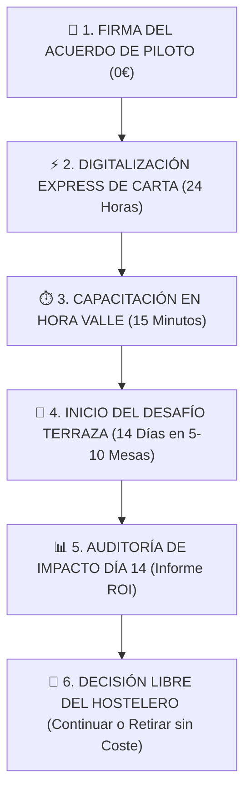

# 📄 ACUERDO DE PILOTO OPERATIVO — DESAFÍO TERRAZA DE 14 DÍAS
> **Programa Oficial de Demostración Operativa en Vivo**  
> **Ámbito:** Noia, Barbanza y Santiago de Compostela  
> **Sistema:** Fluxo Gastronomic System  
> **Coste de Piloto:** 0,00 € | **Permanencia:** Cero (0 días) | **Comisiones por Pedido:** 0,00 %

---



---

## 1. PARTES INTERVINIENTES

* **EL PROVEEDOR TECNOLÓGICO:**  
  **Fluxo Gastronomic System**  
  Representado por la Dirección Comercial y de Operaciones de Fluxo en Galicia.  
  Contacto de Soporte Directo: `+34 [Teléfono Comercial]` | `contacto@fluxogastro.com`

* **EL ESTABLECIMIENTO ADHERIDO:**  
  Nombre Comercial: ___________________________________________________________________  
  Razón Social / CIF: _________________________________________________________________  
  Titular / Gerente / Jefe de Sala: ___________________________________________________  
  Teléfono / WhatsApp de Contacto: ____________________________________________________  
  Dirección del Local: ______________________________________, Municipio: ____________  
  Zona de Terraza Asignada al Piloto: **Mesas nº _______ a la nº _______ (Total: _____ mesas)**

---

## 2. OBJETO Y ALCANCE DEL PILOTO

El presente acuerdo regula la cesión, puesta en marcha y soporte operativo gratuito del ecosistema **Fluxo Gastro** durante un periodo improrrogable de **14 días naturales** a partir de la fecha de activación en sala.

El objetivo del piloto es comprobar objetivamente en la terraza del Establecimiento:
1. **Reducción de pasos muertos:** Ahorro de más de un 40% en desplazamientos de camareros gracias al *Llamador con Intención* (Agua / Pan / Cuenta con Datáfono).
2. **Cero pedidos falsos:** Validación estricta con el filtro *Mozo Gatekeeper* (`pending_validation`) antes de dar pase a cocina.
3. **Agilidad en cobros y rotación:** Reducción del tiempo de entrega de la cuenta de 12 minutos a menos de 2 minutos.

---

## 3. COMPROMISOS ASUMIDOS POR FLUXO (COSTE 0,00 €)

1. **Digitalización Integral de Carta:** Carga completa del menú con fotografías en alta resolución, modificadores de cocina (puntos de carne, guarniciones) y alérgenos normalizados según Reglamento UE 1169/2011 en menos de 24 horas.
2. **Material Físico de Sala:** Suministro en depósito de hasta **12 peanas/soportes QR de alta resistencia** para exterior sin coste para el local.
3. **Capacitación Express:** Sesión formativa presencial de 15 minutos en hora valle para camareros (comandero móvil) y cocina (KDS/impresión).
4. **Soporte Presencial y Remoto:** Asistencia prioritaria durante los turnos fuertes de terraza de viernes a domingo.
5. **Informe de Impacto Día 14:** Entrega de la auditoría de rendimiento (mesas dobladas, km ahorrados y reseñas conseguidas).

---

## 4. COMPROMISOS DEL ESTABLECIMIENTO

1. **Ubicación de Soportes:** Mantener colocadas las peanas QR en las mesas de terraza designadas para el piloto.
2. **Uso del Comandero Mozo:** Utilizar el móvil de sala asignado para pulsar "Validar" en las comandas entrantes y atender los avisos del llamador.
3. **Revisión de Resultados:** Dedicar 15 minutos al término del día 14 para revisar el Informe de Impacto junto al Director Comercial de Fluxo.

---

## 5. CLÁUSULAS DE BLINDAJE PARA EL HOSTELERO

* **CLÁUSULA 1: CERO COSTES Y CERO COMISIONES.**  
  El Establecimiento no abonará ninguna cuota de alta, setup ni mantenimiento durante el periodo piloto. Fluxo no percibe comisiones porcentuales (0%) sobre la facturación ni sobre los cobros realizados.
* **CLÁUSULA 2: NO TOCAR EL TPV NI CAMBIAR DE BANCO.**  
  Fluxo opera de forma desacoplada y no intrusiva. El Establecimiento continuará cobrando a sus clientes en su TPV habitual, con sus datáfonos bancarios de siempre y bajo su propia caja registradora.
* **CLÁUSULA 3: LIBERTAD TOTAL (CERO PERMANENCIA).**  
  Al finalizar los 14 días de prueba, el Establecimiento no tiene ninguna obligación de compra ni permanencia contractual:
  * **Si decide continuar:** Se activará el plan comercial elegido (Plan Sala a 69€/mes o Plan Full a 99€/mes) con el **Setup de 149€ 100% BONIFICADO**.
  * **Si decide no continuar:** Fluxo retirará las peanas QR de prueba de inmediato, sin penalización, sin trámites bancarios y sin preguntas incómodas.

---

## 6. FIRMA Y CONFORMIDAD

En prueba de conformidad y para el inicio inmediato de la digitalización de la carta y preparación de peanas QR, ambas partes firman el presente documento por duplicado:

**En ________________________, a _____ de ____________________ de 2026.**

```
Por FLUXO GASTRONOMIC SYSTEM                 Por EL ESTABLECIMIENTO HOSTELERO


_______________________________________      _______________________________________
Firma: Dirección Comercial y Operaciones     Firma: Gerencia / Titular del Local
DNI/NIF:                                     DNI/NIF:
```
