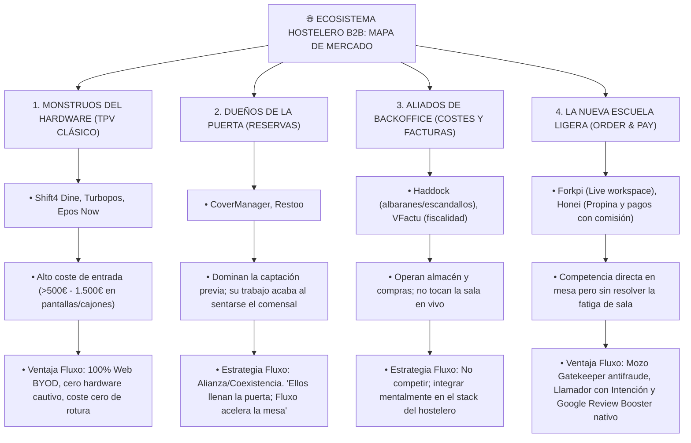

# 📊 BENCHMARK COMPETITIVO GLOBAL — MAPA DE MERCADO HOSTELERO
> **Departamento:** Marketing & Ventas  
> **Fecha:** 2026-10-10  
> **Propósito:** Análisis exhaustivo de los 4 cuadrantes del mercado gastronómico (Hardware POS, Reservas, Backoffice y Order & Pay Ligero) y definición del posicionamiento asimétrico de Fluxo.

---

---

## 1. Desglose por Categorías de Mercado

### 🏢 Categoría 1: Los Monstruos del Hardware (Sistemas POS/TPV Tradicionales)
* **Plataformas Analizadas:** Turbopos, Shift4 Dine (ex SkyTab), Epos Now.
* **Modelo Operativo:** Venta y renting de pantallas táctiles industriales, impresoras fijas, comanderas propietarias y cajones portamonedas inteligentes.
* **Puntos Fuertes:** Integraciones nativas con plataformas de delivery masivo (Glovo, Uber Eats) y control estricto de caja registradora.
* **Puntos Débiles / Fricción del Hostelero:**
  * Coste de entrada desorbitado (500€ a 3.000€).
  * Si se rompe una pantalla un sábado por la noche, el servicio se paraliza y el soporte técnico tarda días en enviar repuesto.
  * Obligan a cambiar de software contable y de datáfono bancario.
* **Postura Estratégica de Fluxo:** **Anti-Hardware (BYOD - Trae Tu Propio Dispositivo)**.
  > *"No toques tu TPV central ni compres pantallas de 800€. Con Fluxo usas cualquier móvil o tablet que ya tengas en el local. Si un móvil se cae al suelo, sacas otro y en 10 segundos el servicio continúa."*

---

### 🚪 Categoría 2: Los Dueños de la Puerta (Gestión de Reservas B2B/B2C)
* **Plataformas Analizadas:** CoverManager, Restoo.
* **Modelo Operativo:** Motores de reservas en web/Instagram, cobro de fianzas anti-no-show, CRM de clientes y guías gastronómicas por geolocalización.
* **Alcance:** Su función termina en el momento exacto en que el comensal cruza el umbral de la puerta y se sienta a la mesa.
* **Postura Estratégica de Fluxo:** **Coexistencia y Alianza**.
  * No gastamos tiempo ni recursos en pelear por reservas complejas con fianzas: CoverManager atrae y sienta al cliente; Fluxo gestiona los pedidos, la cocina, el cobro y la rotación en tiempo real.

---

### 📦 Categoría 3: Los Aliados de Backoffice (Gestión y Costes)
* **Plataformas Analizadas:** Haddock, VFactu.
* **Modelo Operativo:** OCR inteligente de albaranes de proveedores, control de mermas, cálculo de coste de ingredientes (materia prima) y adaptación legal a Veri*Factu.
* **Alcance:** Operación administrativa, financiera y de almacén. No intervienen en la experiencia del comensal ni en el despacho de comandas.
* **Postura Estratégica de Fluxo:** **Complementariedad Absoluta**.
  * El hostelero puede usar Haddock para saber cuánto le cuesta el solomillo y Fluxo para venderlo y despacharlo en la terraza en tiempo récord.

---

### ⚡ Categoría 4: La Nueva Escuela Ligera (Competencia Frontal de Order & Pay)
* **Plataformas Analizadas:** Forkpi, Honei.
* **Modelo Operativo:** Cartas QR interactivas, sincronización en tiempo real entre mesa y cocina, y pago directo desde el móvil.
* **Análisis de sus Ventajas:**
  * **Forkpi:** Live workspace sincronizado en pantalla compartida y gestión visual de pase de platos (pickup counter).
  * **Honei:** Enfoque agresivo en pagos con propina y analítica de ventas por comensal.
* **Vulnerabilidades Detectadas frente a Fluxo:**
  1. **Comisiones Ocultas:** Honei cobra entre un 1.5% y un 2.2% sobre cada cobro por QR, drenando el margen del restaurante. Fluxo cobra **0% de comisiones** (tarifa plana de 69€ o 99€/mes).
  2. **Riesgo de Sabotaje (Falta de Gatekeeper):** En la mayoría de apps de pedido libre, un cliente puede pedir platos falsos o bromas que van directos a cocina. En Fluxo, el **Mozo Gatekeeper** (`pending_validation`) exige la aprobación física o visual del camarero antes de marchar a cocina.
  3. **Fatiga del Camarero en Terraza:** Ninguno dispone del **Llamador de 1 Toque con Intención** (Cuenta con Tarjeta / Agua / Pan), por lo que el camarero sigue teniendo que caminar dos veces a la mesa para preguntar qué desean.
  4. **Google Review Booster:** Ninguno tiene la captación de reseñas de Google Maps como eje central de su promesa de retorno de inversión.

---

## 2. Los 3 Pilares del Posicionamiento Ganador de Fluxo

| Pilar Estratégico | Mensaje Comercial para Hostelería | Impacto Psicológico en el Dueño |
| :--- | :--- | :--- |
| **1. El Caballo de Troya (Reputación)** | *"Fluxo no es solo un comandero: es tu máquina de conseguir reseñas de 5 estrellas en Google en el momento de pagar."* | Desbloquea presupuestos de marketing y reputación, no solo de software técnico. |
| **2. Cero Hardware Cautivo (BYOD)** | *"Si una tablet se rompe, cualquier móvil del cajón sirve. Cero contratos de mantenimiento de 500€."* | Elimina el miedo al soporte técnico deficiente de los TPVs grandes. |
| **3. Cero Comisiones por Ticket** | *"Sigues cobrando en tu datáfono de siempre al 0% de peaje. No somos tus socios forzosos de facturación."* | Protege el margen frente a Honei, Sunday o Qamarero. |
