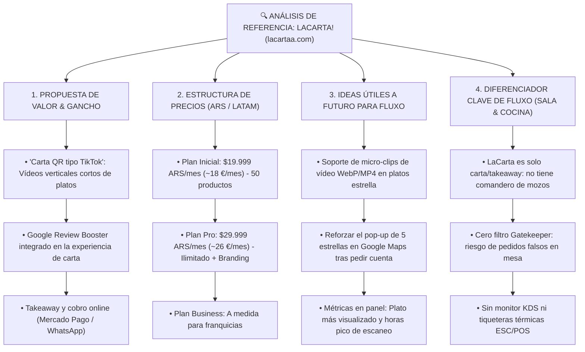

# 📊 BENCHMARK Y ANÁLISIS COMPETITIVO — LACARTA! (lacartaa.com)
> **Departamento:** Marketing & Estrategia B2B  
> **Fecha de Análisis:** 2026-09-18  
> **Propósito:** Banco de referencias de producto, ideas de marketing visual e inteligencia competitiva para futuras evoluciones de Fluxo.

---

---

## 1. Resumen de la Plataforma
* **URL:** `https://lacartaa.com`
* **Posicionamiento:** Carta digital interactiva enfocada en contenido multimedia moderno (video en formato vertical / reels / TikTok) y reputación en Google Maps.
* **Público Objetivo:** Bares, pizzerías, cervecerías y hamburgueserías informales de Latinoamérica (Argentina) que buscan modernizar cartas en PDF estáticas sin invertir en software de TPV completo.

---

## 2. Radiografía de Funcionalidades Clave

### A. Vídeo-Menú Vertical ("Efecto TikTok")
* **Concepto:** Cada plato o bebida puede mostrar un micro-vídeo en bucle mostrando la preparación, la textura o el queso fundido.
* **Beneficio reportado:** Disminuye las dudas del cliente y eleva el ticket medio por deseo visual espontáneo (+8% a +15%).

### B. Recolección Automatizada de Reseñas en Google Maps
* **Concepto:** Mientras el cliente navega o tras pedir la cuenta, la interfaz sugiere dejar una calificación de 5 estrellas en Google Maps con enlace directo al perfil del local.
* **Métrica comercial:** Afirman multiplicar hasta por 5x la captación de reseñas orgánicas en Google.

### C. Analytics de Visualización en Carta
* **Concepto:** Panel de control sencillo que muestra:
  * Total de visitas al QR.
  * Horas pico de visualizaciones.
  * Ranking de platos más vistos / gustados.

### D. Takeaway y Pedidos por WhatsApp
* **Concepto:** El cliente selecciona productos para llevar, paga anticipadamente vía Mercado Pago o envía el pedido formateado a través de WhatsApp.

---

## 3. Matriz Comparativa: LaCarta! vs. FLUXO

| Módulo / Capacidad | LaCarta! (`lacartaa.com`) | **FLUXO GASTRO** | Ventaja Competitiva de Fluxo |
| :--- | :---: | :---: | :--- |
| **Tipo de Producto** | Carta interactiva / Marketing visual | **Sistema Operativo de Sala y Cocina** | Fluxo resuelve la operativa completa del local. |
| **Comandero de Sala para Mozos** | ❌ No | **✅ Sí (Plan Sala 69€)** | Ahorra el 50% de pasos al personal en terraza. |
| **Filtro Mozo Gatekeeper** | ❌ No | **✅ Sí (pending_validation)** | Evita pedidos fantasma o bromas desde la calle. |
| **Llamador de 1 Toque con Intención** | ❌ No | **✅ Sí (Cuenta Tarjeta/Efectivo, Agua)** | El mozo sale directo con el datáfono. |
| **Monitor KDS Cocina (>70px)** | ❌ No | **✅ Sí (Plan Full 99€)** | Despacho visual táctil para cocineros con guantes. |
| **Impresoras Térmicas ESC/POS** | ❌ No | **✅ Sí (Papel 42 col)** | Imprime tickets reales de comanda en el pasaplatos. |
| **Cobro y Comisiones** | Mercado Pago / Pasarelas externas | **0% comisiones (Datáfonos del restaurante)** | Sin comisiones bancarias ni intermediación financiera. |
| **Normativa Alérgenos UE 1169/2011** | ❌ No estandarizado | **✅ Sí (14 alérgenos oficiales)** | Cumplimiento legal obligatorio en España. |

---

## 4. Ideas Extraídas para el Backlog de Futuras Fases de Fluxo (Plan Suite / Mejoras Visuales)

1. **Soporte Multimedia Enriquecido (Fase Futura):**
   * Permitir que los platos estrella de la carta de Fluxo puedan incluir un clip corto de vídeo WebP o MP4 liviano optimizado para móvil.
2. **Refuerzo del Google Review Booster:**
   * Mostrar el botón de calificación en Google Maps justo cuando el cliente pulsa *"Pedir Cuenta"* o tras ser atendido por el mozo.
3. **Métricas de Interés en Carta (Telemetría):**
   * Añadir en el panel administrativo del restaurante el plato más visto del día vs el más pedido en cocina.

---

## 5. Argumentario de Venta en Caso de Comparativa

> *"LaCarta te da una carta bonita con videos, pero no te ayuda cuando la terraza está llena y los camareros están corriendo de un lado a otro. Fluxo te da la carta visual y además conecta al camarero y a la cocina para que no se pierda ni un minuto en el cobro ni en las comandas."*
