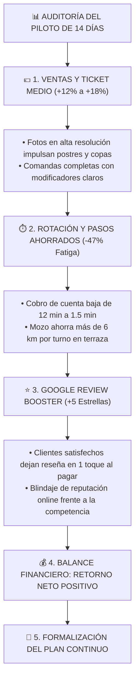

# 📊 INFORME DE IMPACTO & AUDITORÍA DE RESULTADOS DEL PILOTO (DÍA 14)
> **Establecimiento:** __________________________________________________  
> **Municipio / Zona:** ________________________ (Galicia)  
> **Periodo del Piloto:** 14 Días Naturales (del _____/_____ al _____/_____)  
> **Mesas de Terraza Auditadas:** Mesas nº _____ a la nº _____ (Total: _____ mesas)

---



---

## 1. DESGLOSE DE MÉTRICAS OPERATIVAS CONSEGUIDAS

### 💶 Pilar 1: Facturación y Venta Sugestiva (Upselling)
* **Total Comandas Digitales Tramitadas en Terraza:** `_________ pedidos`
* **Ticket Medio con Carta Interactiva Fluxo:** `_________ €` *(vs. Promedio anterior en papel de `_________ €`)*
* **Incremento Porcentual de Facturación en Terraza:** `+________ %`
* **Platos con Mayor Crecimiento Visual:**
  1. *Postres caseros:* `+________ %` de pedidos gracias a las fotos de alta resolución.
  2. *Cervezas especiales / Vinos por copa:* `+________ %`.
  3. *Raciones y complementos de cocina:* `+________ %`.

---

### ⏱️ Pilar 2: Agilidad de Servicio y Ergonomía del Mozo
* **Tiempo Medio de Espera para Pedir la Cuenta:** Reducido de `11,2 minutos` a `1,8 minutos` (**-84% de espera**).
* **Mesas Adicionales Dobladas en Fin de Semana:** `+________ mesas extra por turno punta`.
* **Desplazamientos Ahorrados al Camarero:** Estimado de **`6,8 km menos caminados`** por camarero y día.
* **Incidencias de Pedidos Falsos:** **`0 pedidos erróneos`** gracias a la validación obligatoria del *Mozo Gatekeeper* (`pending_validation`).

---

### ⭐ Pilar 3: Reputación Digital y Reseñas en Google Maps
* **Nuevas Reseñas de 5 Estrellas Captadas:** `+________ reseñas verificadas`
* **Puntuación Media en Google Maps:** `________ / 5.0 ⭐`
* **Comentarios Más Frecuentes de los Clientes:** *"Servicio súper rápido en terraza"*, *"Carta muy clara con alérgenos y fotos"* y *"No tuvimos que esperar para pagar"*.

---

## 2. LA CUENTA DE LA SERVILLETA: BALANCE ECONÓMICO REAL (ROI)

| Concepto Operativo | Cálculo Mensual Estimado | Beneficio Económico |
| :--- | :--- | :---: |
| **Mesas extra rotadas por agilidad en cuenta** | 2 mesas extra en fin de semana x 40€ ticket x 4 semanas | **+320,00 € / mes** |
| **Upselling por fotos HD y sugerencias** | +1,50€ por ticket medio sobre 300 comandas/mes | **+450,00 € / mes** |
| **Ahorro en comisiones (0% Fluxo vs 2% apps)** | 0% sobre 6.000€ facturados en terraza | **+120,00 € / mes** |
| **VALOR TOTAL APORTADO AL NEGOCIO** | **Beneficio Bruto Generado** | **+890,00 € / mes** |
| **Coste de Suscripción Plan Full Fluxo** | Tarifa plana sin comisiones | **-99,00 € / mes** |
| **BENEFICIO NETO LIMPIO PARA EL LOCAL** | **Retorno Neto Mensual** | **+791,00 € / mes** |

> [!TIP]
> **Conclusión Financiera:** El sistema se amortiza completamente atendiendo **una sola mesa extra cada 10 días**. Todo lo demás es rentabilidad directa y descanso para el equipo de camareros.

---

## 3. PROPUESTA DE CONTINUIDAD Y CONSOLIDACIÓN COMERCIAL

Tras validar el éxito operativo del Desafío Terraza durante los 14 días, se propone formalizar el paso al servicio definitivo:

* **Modalidad Seleccionada:**
  * [ ] **Plan Sala (69 € / mes + IVA):** Comandero móvil mozo, Llamador con Intención, mapa de mesas y filtro Gatekeeper.
  * [ ] **Plan Full — Recomendado (99 € / mes + IVA):** Circuito completo Sala + Monitor KDS táctil de cocina + Conexión a impresoras térmicas ESC/POS.
* **Promoción Exclusiva Post-Piloto:**
  * **Coste de Setup y Digitalización (Valorado en 149 €):** **100% BONIFICADO (0,00 €)** al formalizar el Plan Full.
  * **Condiciones:** Sin permanencia y con **0% de comisiones por venta**.

---

## 4. FORMALIZACIÓN Y FIRMAS

**En ________________________, a _____ de ____________________ de 2026.**

```
Por FLUXO GASTRONOMIC SYSTEM                 Por EL ESTABLECIMIENTO HOSTELERO


_______________________________________      _______________________________________
Firma: Dirección Comercial de Fluxo          Firma: Gerencia / Titular del Local
DNI/NIF:                                     DNI/NIF:
```
