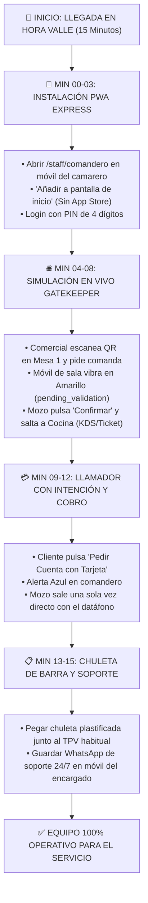

# ⏱️ PROTOCOLO DE ONBOARDING EXPRESS EN SALA — 15 MINUTOS (HORA VALLE)
> **Departamento:** Marketing, Ventas y Operaciones de Sala  
> **Objetivo:** Capacitar al equipo de camareros y cocina en el uso de Fluxo sin interrumpir el servicio ni generar fricción.  
> **Momento Óptimo:** 11:00 a 12:15 (montaje de terraza) o 17:00 a 18:30 (sobremesa/cambio de turno).

---



---

## 1. PREPARACIÓN PREVIA (ANTES DE LLEGAR AL LOCAL)

El comercial o técnico de campo debe llevar listo en su mochila:
* [x] Carta del restaurante 100% digitalizada en la base de datos de Fluxo con fotos y alérgenos.
* [x] Pack de 5 a 12 peanas QR numeradas y listas para exterior.
* [x] Chuleta adhesiva de barra plastificada (A5 o tamaño tarjeta).
* [x] Móvil o tablet de demostración con batería cargada.

---

## 2. GUION PASO A PASO DE LOS 15 MINUTOS

### 🕒 Minutos 00 a 03: Acceso Instantáneo PWA (Cero App Store)
1. Pedir al camarero o encargado que abra el navegador en su móvil (Safari en iPhone o Chrome en Android).
2. Introducir la URL del local: `fluxogastro.com/staff/comandero/[slug-local]`
3. Indicarle: *"Pulsa Compartir / Opciones -> Añadir a la pantalla de inicio"*.
4. **Resultado:** Queda un icono idéntico a una app nativa, con arranque instantáneo y sin ocupar memoria.
5. Introducir el PIN asignado (ej. `1234`).

---

### 🕒 Minutos 04 a 08: El Circuito del "Mozo Gatekeeper" en Vivo
1. El comercial se sienta en la **Mesa 1 de la terraza** y escanea el QR con su propio teléfono.
2. Añade 2 cañas y 1 ración de calamares y pulsa *"Enviar Pedido"*.
3. El teléfono del camarero emite una vibración y sonido característico. La Mesa 1 aparece en **Amarillo parpadeante** (`pending_validation`).
4. **Explicación clave al camarero:**
   > *"Mira tu pantalla: la comanda ha entrado en espera. Cocina NO ve nada todavía. Si alguien hace una broma desde la calle, no pasa nada. Tú vas a la mesa, confirmas y pulsas el botón verde 'Aprobar a Cocina'. Recién ahí salta en cocina."*
5. El camarero pulsa el botón verde: la comanda cambia a color **Verde (En Cocina)** y se imprime el ticket / aparece en el KDS.

---

### 🕒 Minutos 09 a 12: Llamador con Intención (El Fin de los Pasos Basura)
1. El comercial pulsa en su móvil el botón del llamador: **"Pedir Cuenta con Tarjeta"**.
2. En el comandero del mozo aparece la alerta en **Azul** especificando: `Mesa 1: Cuenta con Tarjeta`.
3. **Explicación clave:**
   > *"¿Ves la diferencia? Antes tenías que caminar hasta la terraza solo para preguntar qué querían y luego volver a por el datáfono. Ahora sales una sola vez directo con el datáfono en la mano. Te ahorras 80 metros por cada mesa."*
4. El camarero pulsa *"Atendido"* y la mesa queda limpia.

---

### 🕒 Minutos 13 a 15: Material de Apoyo y Teléfono de Emergencia
1. Pegar la **Chuleta Rápida de Barra** en un lugar visible (junto a la cafetera o datáfono).
2. Guardar el número de WhatsApp de soporte técnico de guardia en el teléfono del encargado.
3. Dejar colocados los soportes QR en las mesas pactadas para el piloto.

---

## 3. CHULETA RÁPIDA DE SALA (TEXTO PARA LA PEGATINA DE BARRA)

```text
┌─────────────────────────────────────────────────────────────┐
│              FLUXO GASTRO — GUÍA RÁPIDA DE SALA             │
├─────────────────────────────────────────────────────────────┤
│ 🟡 COLOR AMARILLO: Comanda pendiente de validar en mesa     │
│    -> Ve a la mesa, confirma el pedido y pulsa 'Aprobar'.   │
│                                                             │
│ 🔵 COLOR AZUL: Llamada de comensal con intención            │
│    -> 'Cuenta con Tarjeta': Lleva el datáfono directo.      │
│    -> 'Agua / Pan': Lleva el servicio en 1 solo viaje.      │
│                                                             │
│ 🟢 COLOR VERDE: Comanda despachándose en cocina.            │
│                                                             │
│ 🆘 SOPORTE TÉCNICO 24/7 WHATSAPP: +34 [Teléfono Soporte]    │
└─────────────────────────────────────────────────────────────┘
```

---

## 4. CHECKLIST DE CIERRE DE ONBOARDING PARA EL COMERCIAL

- [ ] ¿El camarero principal ha probado a validar una comanda real en su móvil?
- [ ] ¿Cocina ha confirmado la recepción correcta del pedido de prueba?
- [ ] ¿Las peanas QR de la terraza están limpias y bien orientadas?
- [ ] ¿El encargado tiene guardado el contacto de WhatsApp para dudas durante el servicio?
