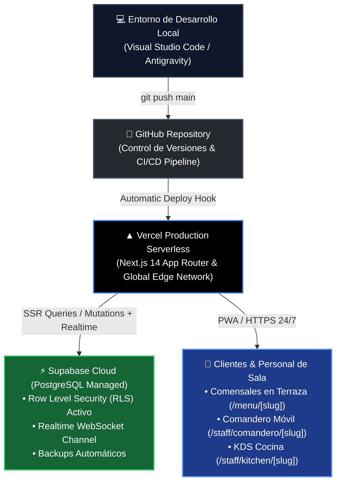
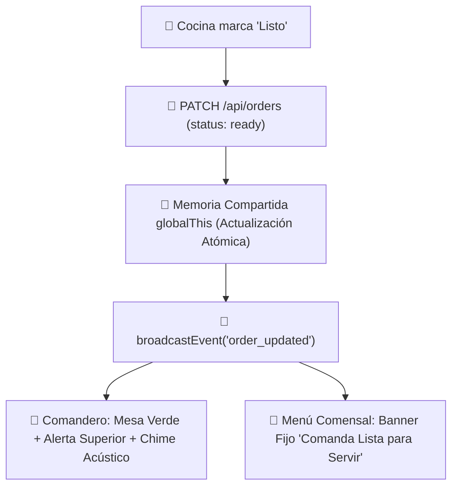

# ⚙️ INGENIERÍA & ARQUITECTURA TÉCNICA — FLUXO
> **Departamento:** Ingeniería de Software, Backend & QA  
> **Chat Asociado:** [`64445573-62cb-4897-b2f1-f89015d7ea45`](conversation://64445573-62cb-4897-b2f1-f89015d7ea45)

---

## 🏗️ Puntos Críticos de la Arquitectura

1. **Mozo Gatekeeper (`pending_validation`):**
   - La comanda nace en `pending_validation`.
   - La pantalla de cocina `/staff/kitchen/[slug]` filtra y excluye `pending_validation`.
   - El mozo valida vía `PATCH /api/orders` con `status: 'pending'` para marchar la comanda a cocina.

2. **Idempotencia sin TOCTOU (PostgreSQL):**
   - Restricción `UNIQUE (idempotency_key)`.
   - Inserción atómica con `ON CONFLICT DO NOTHING`.
   - Cero riesgo de comandas duplicadas por doble clic nervioso del comensal.

3. **Criptografía de PINs (Bcrypt + Rate Limiting):**
   - Hashing de contraseñas con `bcrypt` (10 rondas de sal).
   - Bloqueo por fuerza bruta tras 5 intentos fallidos.
   - Sesiones firmadas con cookies `HttpOnly` y HMAC-SHA256 (12h de duración por turno).

4. **Resiliencia de Sesión en Safari iOS (ITP):**
   - Cookies `HttpOnly` de primer origen.
   - Endpoint `/api/session/restore` para reconstruir la comanda activa si Safari vacía el `localStorage`.

5. **API de Impresoras Térmicas (ESC/POS):**
   - Endpoint: `/api/printers/receipt?order_id=...&width=42`.
   - Generación de comandos binarios con inicialización (`\x1b@`), campana sonora (`\x1bB\x02\x02`) y corte de papel automático (`\x1dV\x00`).

---

## ☁️ 6. Arquitectura Productiva Cloud: El Triángulo de Alta Disponibilidad

* **Variables de Entorno en Vercel:**
  - `NEXT_PUBLIC_SUPABASE_URL`: Endpoint de Supabase Cloud.
  - `NEXT_PUBLIC_SUPABASE_ANON_KEY`: Llave pública para lecturas con RLS.
  - `SUPABASE_SERVICE_ROLE_KEY`: Llave segura para transacciones de backend.
  - `NEXT_PUBLIC_APP_URL`: Dominio oficial de producción en Vercel (`https://fluxo-*.vercel.app` o dominio propio).
* **Garantía Operativa:**
  - Cero dependencias de servidores locales encendidos o túneles ngrok/localtunnel efímeros.
  - Respaldo transaccional en PostgreSQL con failover y escalado automático de peticiones concurrentes en picos de terraza.

---

## ⚡ 7. Sincronización en Tiempo Real y Memoria Viva (`globalThis` + SSE)

1. **Memoria Singleton `globalThis`:**
   - Previene desincronizaciones entre worker threads o server actions en Next.js.
   - Las consultas de lectura `GET` nunca emiten broadcasts de eventos para evitar bucles recursivos de polling.
2. **Estado de Comanda Blindado (`Sticky State`):**
   - El estado del pedido en la pantalla del cliente no se borra ante micro-latencias de red; solo se limpia cuando el mozo libera la mesa (`free`) o se completa el cobro de la cuenta (`attended`).

---

## ☕ 8. Ciclo de Sobremesa y Google Review Booster

1. **Tarjeta Unificada de Entrega:**
   - Al marcarse `delivered`, se muestra una sola tarjeta compacta en fondo oscuro con dos botones: `[☕🍰 Café / Postres]` (acceso directo al catálogo) y `[💳 Pedir la Cuenta]`.
2. **Momento Psicológico Óptimo:**
   - La tarjeta de reseñas en Google Maps (`<GoogleReviewBooster />`) permanece oculta durante la comida y se activa **exclusivamente al solicitar la cuenta**, aprovechando la espera antes del cobro para captar valoraciones de 5 estrellas.
