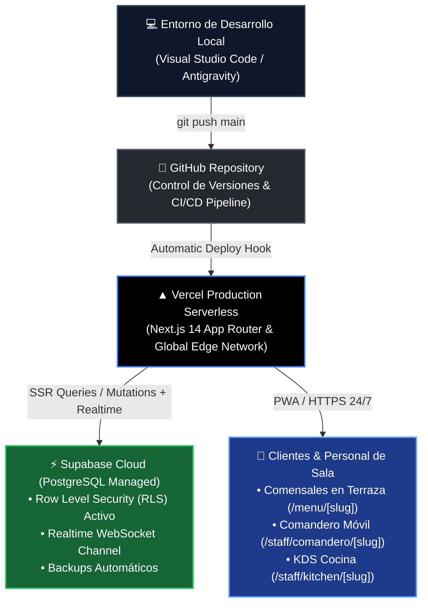
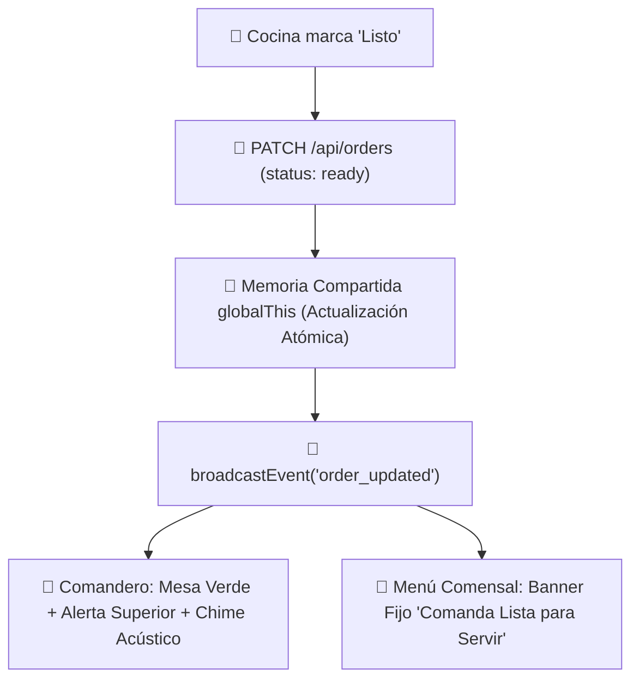

# ⚙️ INGENIERÍA & ARQUITECTURA TÉCNICA — FLUXO
> **Departamento:** Ingeniería de Software, Backend & QA  
> **Chat Asociado:** [`64445573-62cb-4897-b2f1-f89015d7ea45`](conversation://64445573-62cb-4897-b2f1-f89015d7ea45)

---

## 🏗️ Puntos Críticos de la Arquitectura

1. **Mozo Gatekeeper (`pending_validation`):**
   - La comanda nace en `pending_validation`.
   - La pantalla de cocina `/staff/kitchen/[slug]` filtra y excluye `pending_validation`.
   - El mozo valida vía `PATCH /api/orders` con `status: 'pending'` para marchar la comanda a cocina.

2. **Idempotencia sin TOCTOU (PostgreSQL):**
   - Restricción `UNIQUE (idempotency_key)`.
   - Inserción atómica con `ON CONFLICT DO NOTHING`.
   - Cero riesgo de comandas duplicadas por doble clic nervioso del comensal.

3. **Criptografía de PINs (Bcrypt + Rate Limiting):**
   - Hashing de contraseñas con `bcrypt` (10 rondas de sal).
   - Bloqueo por fuerza bruta tras 5 intentos fallidos.
   - Sesiones firmadas con cookies `HttpOnly` y HMAC-SHA256 (12h de duración por turno).

4. **Resiliencia de Sesión en Safari iOS (ITP):**
   - Cookies `HttpOnly` de primer origen.
   - Endpoint `/api/session/restore` para reconstruir la comanda activa si Safari vacía el `localStorage`.

5. **API de Impresoras Térmicas (ESC/POS):**
   - Endpoint: `/api/printers/receipt?order_id=...&width=42`.
   - Generación de comandos binarios con inicialización (`\x1b@`), campana sonora (`\x1bB\x02\x02`) y corte de papel automático (`\x1dV\x00`).

---

## ☁️ 6. Arquitectura Productiva Cloud: El Triángulo de Alta Disponibilidad

* **Variables de Entorno en Vercel:**
  - `NEXT_PUBLIC_SUPABASE_URL`: Endpoint de Supabase Cloud.
  - `NEXT_PUBLIC_SUPABASE_ANON_KEY`: Llave pública para lecturas con RLS.
  - `SUPABASE_SERVICE_ROLE_KEY`: Llave segura para transacciones de backend.
  - `NEXT_PUBLIC_APP_URL`: Dominio oficial de producción en Vercel (`https://fluxo-*.vercel.app` o dominio propio).
* **Garantía Operativa:**
  - Cero dependencias de servidores locales encendidos o túneles ngrok/localtunnel efímeros.
  - Respaldo transaccional en PostgreSQL con failover y escalado automático de peticiones concurrentes en picos de terraza.

---

## ⚡ 7. Sincronización en Tiempo Real y Memoria Viva (`globalThis` + SSE)

1. **Memoria Singleton `globalThis`:**
   - Previene desincronizaciones entre worker threads o server actions en Next.js.
   - Las consultas de lectura `GET` nunca emiten broadcasts de eventos para evitar bucles recursivos de polling.
2. **Estado de Comanda Blindado (`Sticky State`):**
   - El estado del pedido en la pantalla del cliente no se borra ante micro-latencias de red; solo se limpia cuando el mozo libera la mesa (`free`) o se completa el cobro de la cuenta (`attended`).

---

## ☕ 8. Ciclo de Sobremesa y Google Review Booster

1. **Tarjeta Unificada de Entrega:**
   - Al marcarse `delivered`, se muestra una sola tarjeta compacta en fondo oscuro con dos botones: `[☕🍰 Café / Postres]` (acceso directo al catálogo) y `[💳 Pedir la Cuenta]`.
2. **Momento Psicológico Óptimo:**
   - La tarjeta de reseñas en Google Maps (`<GoogleReviewBooster />`) permanece oculta durante la comida y se activa **exclusivamente al solicitar la cuenta**, aprovechando la espera antes del cobro para captar valoraciones de 5 estrellas.

---

## 🛡️ 9. Protección Anti-Bot con Cloudflare Turnstile (`src/lib/cloudflare.ts`)

1. **Defensa Invisible:**
   - Componente cliente `<CloudflareTurnstile />` montado en el modal de solicitud de piloto (`PilotRequestModal.tsx`).
   - Evita bots y spam automatizado sin presentar CAPTCHAs que frustren al hostelero.
2. **Validación Server-Side:**
   - El endpoint `POST /api/pilots/request` valida el token mediante `verifyTurnstileToken()` contra la API oficial de Cloudflare (`https://challenges.cloudflare.com/turnstile/v0/siteverify`).
   - Soporte para claves de prueba oficiales en entornos de desarrollo sin bloquear pruebas locales.

---

## 📉 10. Guardas de Egress y Bounded Queries en Supabase PostgreSQL

1. **Límite Estricto en Consultas (`.limit(60)`):**
   - La función `getRestaurantOrders` en `src/lib/supabase/repository.ts` restringe la recuperación de pedidos a un máximo de 60 comandas recientes.
   - Evita la descarga de miles de pedidos históricos en cada llamada de sincronización (polling cada 3-4s).
2. **Consulta Focalizada por Mesa:**
   - `getActiveOrdersByTable` ejecuta un filtro SQL indexado (`.eq('table_number', tableNumber).limit(20)`) en lugar de descargar todo el historial del local para filtrarlo en memoria de Node.js.
   - Reducción del tráfico por petición de ~3 MB a <3 KB (99.8% de ahorro de ancho de banda).

---

## 🧪 11. Suite de Certificación Multi-Agente (132/132 Checks)

1. **Protocolo Pre-Deploy Obligatorio:**
   - `npx.cmd tsc --noEmit`: 0 errores de tipado TypeScript 5.7.
   - `npm.cmd run build`: 11/11 rutas estáticas y dinámicas compiladas en producción.
   - `node scripts/security_rls_audit.mjs`: 30/30 políticas RLS verificadas.
   - `python scripts/run_strix_scan.py`: 8/8 directivas de penetración aprobadas.
   - `npx.cmd playwright test`: 10/10 tests E2E en Chromium headless (Carta -> Mozo -> Cocina).
   - `node scripts/test_challenger_invariants.mjs`: 18/18 invariantes de estrés.
   - `node scripts/test_challenger_r5_2_adversarial_verification.mjs`: 42/42 pruebas OCC y transiciones atómicas.
