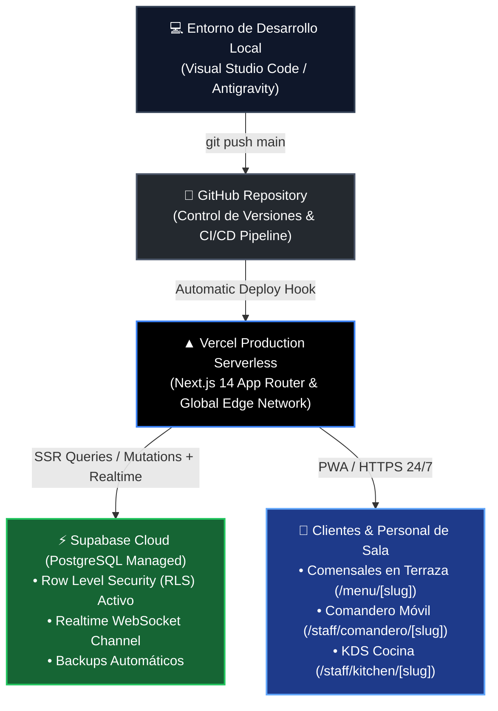
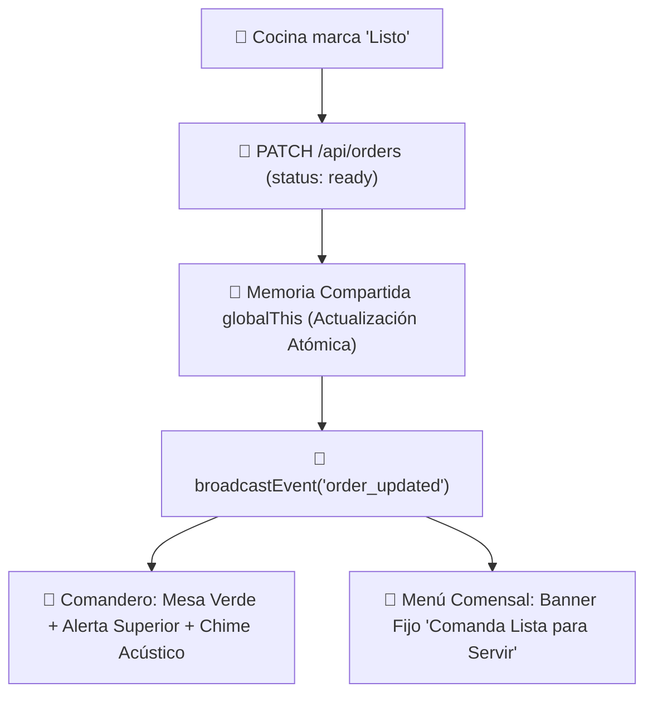
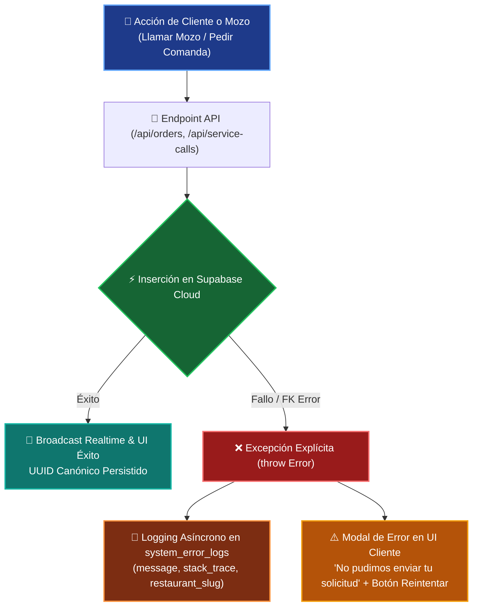

# ⚙️ INGENIERÍA & ARQUITECTURA TÉCNICA — FLUXO
> **Departamento:** Ingeniería de Software, Backend & QA  
> **Chat Asociado:** [`64445573-62cb-4897-b2f1-f89015d7ea45`](conversation://64445573-62cb-4897-b2f1-f89015d7ea45)

---

## 🏗️ Puntos Críticos de la Arquitectura

1. **Mozo Gatekeeper (`pending_validation`):**
   - La comanda nace en `pending_validation`.
   - La pantalla de cocina `/staff/kitchen/[slug]` filtra y excluye `pending_validation`.
   - El mozo valida vía `PATCH /api/orders` con `status: 'pending'` para marchar la comanda a cocina.

2. **Idempotencia sin TOCTOU (PostgreSQL):**
   - Restricción `UNIQUE (idempotency_key)`.
   - Inserción atómica con `ON CONFLICT DO NOTHING`.
   - Cero riesgo de comandas duplicadas por doble clic nervioso del comensal.

3. **Criptografía de PINs (Bcrypt + Rate Limiting):**
   - Hashing de contraseñas con `bcrypt` (10 rondas de sal).
   - Bloqueo por fuerza bruta tras 5 intentos fallidos.
   - Sesiones firmadas con cookies `HttpOnly` y HMAC-SHA256 (12h de duración por turno).

4. **Resiliencia de Sesión en Safari iOS (ITP):**
   - Cookies `HttpOnly` de primer origen.
   - Endpoint `/api/session/restore` para reconstruir la comanda activa si Safari vacía el `localStorage`.

5. **API de Impresoras Térmicas (ESC/POS):**
   - Endpoint: `/api/printers/receipt?order_id=...&width=42`.
   - Generación de comandos binarios con inicialización (`\x1b@`), campana sonora (`\x1bB\x02\x02`) y corte de papel automático (`\x1dV\x00`).

---

## ☁️ 6. Arquitectura Productiva Cloud: El Triángulo de Alta Disponibilidad


```mermaid
flowchart TD
    DEV["💻 Entorno de Desarrollo Local<br/>(Visual Studio Code / Antigravity)"]
    DEV -->|git push main| GH["🐙 GitHub Repository<br/>(Control de Versiones & CI/CD Pipeline)"]
    GH -->|Automatic Deploy Hook| VER["▲ Vercel Production Serverless<br/>(Next.js 14 App Router & Global Edge Network)"]
    VER -->|SSR Queries / Mutations + Realtime| SUPA["⚡ Supabase Cloud (PostgreSQL Managed)<br/>• Row Level Security (RLS) Activo<br/>• Realtime WebSocket Channel<br/>• Backups Automáticos"]
    
    VER -->|PWA / HTTPS 24/7| USERS["👥 Clientes & Personal de Sala<br/>• Comensales en Terraza (/menu/[slug])<br/>• Comandero Móvil (/staff/comandero/[slug])<br/>• KDS Cocina (/staff/kitchen/[slug])"]
    
    style DEV fill:#0f172a,stroke:#334155,stroke-width:2px,color:#ffffff
    style GH fill:#24292f,stroke:#4a5568,stroke-width:2px,color:#ffffff
    style VER fill:#000000,stroke:#3b82f6,stroke-width:2px,color:#ffffff
    style SUPA fill:#166534,stroke:#22c55e,stroke-width:2px,color:#ffffff
    style USERS fill:#1e3a8a,stroke:#60a5fa,stroke-width:2px,color:#ffffff
```

* **Variables de Entorno en Vercel:**
  - `NEXT_PUBLIC_SUPABASE_URL`: Endpoint de Supabase Cloud.
  - `NEXT_PUBLIC_SUPABASE_ANON_KEY`: Llave pública para lecturas con RLS.
  - `SUPABASE_SERVICE_ROLE_KEY`: Llave segura para transacciones de backend.
  - `NEXT_PUBLIC_APP_URL`: Dominio oficial de producción en Vercel (`https://fluxo-*.vercel.app` o dominio propio).
* **Garantía Operativa:**
  - Cero dependencias de servidores locales encendidos o túneles ngrok/localtunnel efímeros.
  - Respaldo transaccional en PostgreSQL con failover y escalado automático de peticiones concurrentes en picos de terraza.

---

## ⚡ 7. Sincronización en Tiempo Real y Memoria Viva (`globalThis` + SSE)


```mermaid
flowchart TD
    KDS["🍳 Cocina marca 'Listo'"] --> API["📡 PATCH /api/orders (status: ready)"]
    API --> MEM["🧠 Memoria Compartida globalThis (Actualización Atómica)"]
    MEM --> BROAD["📢 broadcastEvent('order_updated')"]
    BROAD --> MOZO["🔔 Comandero: Mesa Verde + Alerta Superior + Chime Acústico"]
    BROAD --> DINER["📱 Menú Comensal: Banner Fijo 'Comanda Lista para Servir'"]
```

1. **Memoria Singleton `globalThis`:**
   - Previene desincronizaciones entre worker threads o server actions en Next.js.
   - Las consultas de lectura `GET` nunca emiten broadcasts de eventos para evitar bucles recursivos de polling.
2. **Estado de Comanda Blindado (`Sticky State`):**
   - El estado del pedido en la pantalla del cliente no se borra ante micro-latencias de red; solo se limpia cuando el mozo libera la mesa (`free`) o se completa el cobro de la cuenta (`attended`).

---

## ☕ 8. Ciclo de Sobremesa y Google Review Booster

1. **Tarjeta Unificada de Entrega:**
   - Al marcarse `delivered`, se muestra una sola tarjeta compacta en fondo oscuro con dos botones: `[☕🍰 Café / Postres]` (acceso directo al catálogo) y `[💳 Pedir la Cuenta]`.
2. **Momento Psicológico Óptimo:**
   - La tarjeta de reseñas en Google Maps (`<GoogleReviewBooster />`) permanece oculta durante la comida y se activa **exclusivamente al solicitar la cuenta**, aprovechando la espera antes del cobro para captar valoraciones de 5 estrellas.

---

## 🛡️ 9. Protección Anti-Bot con Cloudflare Turnstile (`src/lib/cloudflare.ts`)

1. **Defensa Invisible:**
   - Componente cliente `<CloudflareTurnstile />` montado en el modal de solicitud de piloto (`PilotRequestModal.tsx`).
   - Evita bots y spam automatizado sin presentar CAPTCHAs que frustren al hostelero.
2. **Validación Server-Side:**
   - El endpoint `POST /api/pilots/request` valida el token mediante `verifyTurnstileToken()` contra la API oficial de Cloudflare (`https://challenges.cloudflare.com/turnstile/v0/siteverify`).
   - Soporte para claves de prueba oficiales en entornos de desarrollo sin bloquear pruebas locales.

---

## 📉 10. Guardas de Egress y Bounded Queries en Supabase PostgreSQL

1. **Límite Estricto en Consultas (`.limit(60)`):**
   - La función `getRestaurantOrders` en `src/lib/supabase/repository.ts` restringe la recuperación de pedidos a un máximo de 60 comandas recientes.
   - Evita la descarga de miles de pedidos históricos en cada llamada de sincronización (polling cada 3-4s).
2. **Consulta Focalizada por Mesa:**
   - `getActiveOrdersByTable` ejecuta un filtro SQL indexado (`.eq('table_number', tableNumber).limit(20)`) en lugar de descargar todo el historial del local para filtrarlo en memoria de Node.js.
   - Reducción del tráfico por petición de ~3 MB a <3 KB (99.8% de ahorro de ancho de banda).

---

## 🧪 11. Suite de Certificación Multi-Agente (132/132 Checks)

1. **Protocolo Pre-Deploy Obligatorio:**
   - `npx.cmd tsc --noEmit`: 0 errores de tipado TypeScript 5.7.
   - `npm.cmd run build`: 11/11 rutas estáticas y dinámicas compiladas en producción.
   - `node scripts/security_rls_audit.mjs`: 30/30 políticas RLS verificadas.
   - `python scripts/run_strix_scan.py`: 8/8 directivas de penetración aprobadas.
   - `npx.cmd playwright test`: 10/10 tests E2E en Chromium headless (Carta -> Mozo -> Cocina).
   - `node scripts/test_challenger_invariants.mjs`: 18/18 invariantes de estrés.
   - `node scripts/test_challenger_r5_2_adversarial_verification.mjs`: 42/42 pruebas OCC y transiciones atómicas.

---

## 🛡️ 12. Invariante Anti-Phantom Data, SSOT Estricto en Supabase y Telemetría `system_error_logs`
> **Origen Metodológico:** Mesa Técnica de Estabilidad (Emiliano Gómez, Guillermo F. Gómez & Ignacio Cerutti Norris — 04/10/2026).


```mermaid
flowchart TD
    SUBMIT["📱 Acción de Cliente o Mozo<br/>(Llamar Mozo / Pedir Comanda)"] --> API["📡 Endpoint API (/api/orders, /api/service-calls)"]
    API --> SUPA{"⚡ Inserción en Supabase Cloud"}
    
    SUPA -->|Éxito| REALTIME["📢 Broadcast Realtime & UI Éxito<br/>UUID Canónico Persistido"]
    
    SUPA -->|Fallo / FK Error| ERR["❌ Excepción Explícita (throw Error)"]
    ERR --> LOG["📝 Logging Asíncrono en system_error_logs<br/>(message, stack_trace, restaurant_slug)"]
    ERR --> UI_FAIL["⚠️ Modal de Error en UI Cliente<br/>'No pudimos enviar tu solicitud' + Botón Reintentar"]
    
    style SUBMIT fill:#1e3a8a,stroke:#60a5fa,stroke-width:2px,color:#ffffff
    style SUPA fill:#166534,stroke:#22c55e,stroke-width:2px,color:#ffffff
    style REALTIME fill:#0f766e,stroke:#14b8a6,stroke-width:2px,color:#ffffff
    style ERR fill:#991b1b,stroke:#f87171,stroke-width:2px,color:#ffffff
    style LOG fill:#7c2d12,stroke:#fb923c,stroke-width:2px,color:#ffffff
    style UI_FAIL fill:#b45309,stroke:#f59e0b,stroke-width:2px,color:#ffffff
```

### 1. Erradicación Absoluta de Fallbacks Sintéticos en Memoria (Anti-Phantom Invariant)
* **Diagnóstico de la Falla Histórica:** En versiones iniciales de `src/lib/supabase/repository.ts` (`createServiceCall`, `createOrder`), ante un error de red o violación de clave foránea (`foreign key`), el código capturaba la excepción y creaba un objeto sintético provisional en memoria (`call-${Date.now()}...` u `ord-${Date.now()}...`). Dicho objeto fingía éxito momentáneo, pero inundaba la memoria de Vercel/Node.js y el polling del comandero con decenas de alertas huérfanas que jamás existieron en PostgreSQL.
* **Invariante de Arquitectura:** Queda **terminantemente prohibido** simular entidades exitosas con identificadores ficticios. Si Supabase falla:
  1. El servidor debe arrojar un error explícito (`throw error`), respondiendo HTTP 500 con código de fallo tipificado.
  2. El cliente (`CartDrawer.tsx` o vista de mesa) debe retener los datos en el carrito o formulario y desplegar un modal informativo accesible con botón interactivo de **Reintentar**.
  3. Supabase Cloud se mantiene como **Fuente Única de Verdad (SSOT)**: el comandero y la cocina solo leen y muestran registros con UUID reales persistidos en base de datos.

### 2. Tabla Centralizada de Auditoría: `system_error_logs`
* **Definición de Esquema:** `supabase/migrations/20260917_system_error_logs.sql`.
  - Columnas: `id` (UUID), `timestamp` (TIMESTAMPTZ), `error_code` (TEXT), `message` (TEXT), `stack_trace` (TEXT), `restaurant_slug` (TEXT), `restaurant_id` (UUID nullable), `created_at` (TIMESTAMPTZ).
  - Índices dedicados en `timestamp DESC`, `restaurant_slug`, `error_code` y `restaurant_id`.
  - **Row Level Security (RLS)** habilitado con políticas de inserción y lectura autorizada.
* **Persistencia No Bloqueante (`src/lib/logger.ts`, `src/lib/supabase/error-logs.ts`):**
  - Todo error capturado en endpoints y repositorios se envía de forma asíncrona a `system_error_logs` mediante un bloque aislado que jamás interrumpe la respuesta HTTP ni degrada la latencia percibida por el usuario.

### 3. Protocolo Forense de Diagnóstico SQL (Guillermo F. Gómez)
* **Búsqueda con comodines en columnas UUID:** En PostgreSQL/Supabase, el operador `LIKE` falla sobre tipos UUID. Es obligatorio forzar conversión de tipo:
  ```sql
  SELECT * FROM service_calls WHERE CAST(id AS varchar) LIKE '%call%';
  ```
* **Guardas de Consulta en Exploración:** Utilizar siempre `LIMIT 5` o `LIMIT 10` al auditar incidencias en el SQL Editor para evitar descargas masivas de memoria.
* **Plantilla Condicional Rápida:**
  ```sql
  SELECT * FROM service_calls 
  WHERE 1 = 1 
  -- AND status = 'pending'
  -- AND restaurant_id = '...'
  ORDER BY created_at DESC 
  LIMIT 5;
  ```
* **Pruebas Concurrentes Multi-Mesa:** Para validar Realtime sin colisiones de sesión en simulador, duplicar pestañas del navegador abriendo concurrentemente mesas distintas (ej. Mesa 1 y Mesa 7), verificando que las alertas se agrupen y resuelvan de forma aislada en el comandero del mozo.

### 4. Metodología de Desarrollo y Colaboración Asistida por IA
* **Spec-Driven Development (SDD):** El desarrollador asume el rol de **Arquitecto de Software**: redacta la especificación funcional, los casos borde y las restricciones técnicas antes de delegar la escritura de código a la IA.
* **Principio de Responsabilidad Única (SOLID):** Desacoplar estrictamente la creación, atención y consulta de entidades en métodos y endpoints independientes para acotar el radio de impacto de cualquier incidencia técnica.
* **Aislamiento en Ramas de Git (`git branch`):** Todo experimento, refactorización o desarrollo asistido por IA debe realizarse en ramas independientes (`feature/...` o `fix/...`), preservando la rama `main` en estado prístino para demostraciones y producción.
* **Validación Focalizada Previa a Commits:** Modificar y ejecutar primero los tests unitarios correspondientes a la funcionalidad alterada antes de ejecutar despliegues o suites pesadas.

