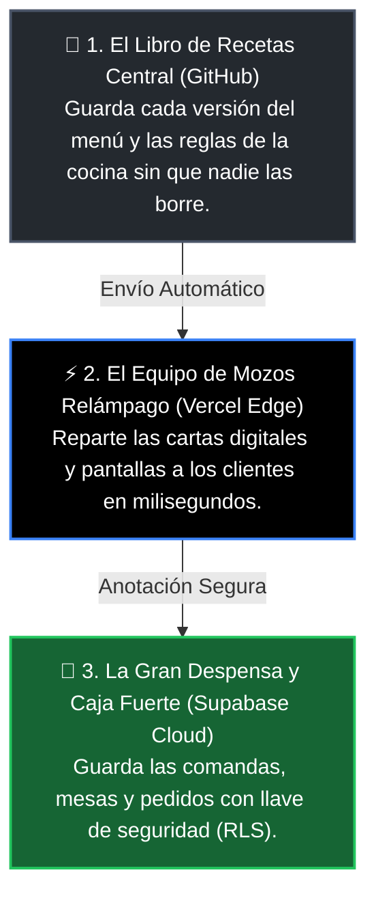
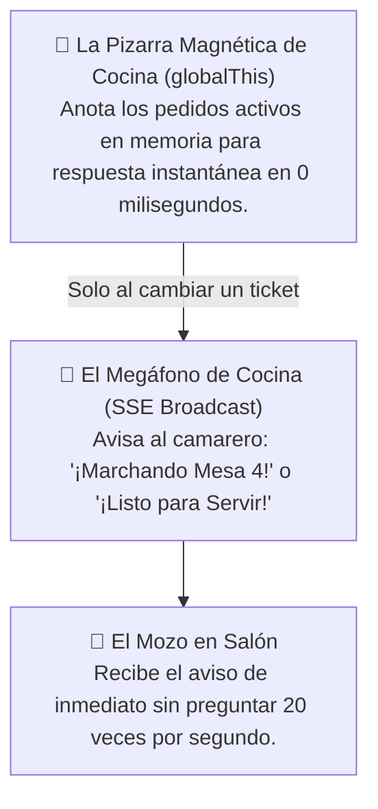

# 🧠 DEPARTAMENTO 5: LEARNING & KNOWLEDGE BASE — FLUXO

> **Departamento:** Aprendizaje Continuo, Auditoría de Mercado & Metodología Agéntica  
> **Propósito:** Capitalizar cada dato del mercado, analizar competidores y blindar las mejores prácticas de desarrollo y gobernanza en Fluxo.  
> **Fecha de Fundación:** 31 de Agosto de 2026

---

## 1. 🔬 Inteligencia sobre Competidores: El Ecosistema "Qamarero"

* **Entidad Comercial:** QR Payments S.L.
* **Apoyo Institucional / Subvenciones:** Enisa, Ministerio de Industria, Ministerio de Agricultura, CaixaBank (DayOne).
* **Estrategia Comercial Observada:**
  - Macro-campañas de paid media en Instagram/TikTok ("Todo en 1 sola herramienta por 8.000€/año").
  - Herramienta de prospección automatizada (`analiza.qamarero.com`) que rastrea Place IDs de Google para infundir miedo con pérdidas ficticias de 600€ a 900€/mes.
  - Exigencia de cambio total de TPV contable y cobro mediante su pasarela transaccional.
* **La Ventaja Asimétrica de Fluxo:**
  - **Especialización Quirúrgica:** Mientras la competencia abarca desde el control horario hasta la fiscalidad (generando software pesado y propenso a caídas), Fluxo se enfoca 100% en la velocidad del camarero en terraza y el ritmo de cocina.
  - **Fricción Cero:** Se adopta en 1 hora sin cambiar de banco, sin comisiones por ticket y sin alterar el TPV tradicional.

---

## 2. 🤖 Disciplina Agéntica y Buenas Prácticas en Antigravity

A raíz de los análisis de metodologías agénticas y discusiones técnicas de desarrolladores:

### A. La Regla de los Markdown Modulares
* **El Problema del Prompt Bloat:** Si se acumulan instrucciones infinitas en un único prompt o contexto, los LLM sufren de olvido de instrucciones (*attention drift*) o alucinaciones.
* **El Estándar Fluxo:**
  1. La verdad del proyecto reside en archivos markdown estructurados en `/docs/departamentos/`.
  2. Cada departamento tiene su archivo canónico (`reglas_operativas.md`, `design_system.md`, etc.).
  3. Toda decisión técnica o de negocio se registra de inmediato en `LOG_DE_SINCRONIZACION_INTERDEPARTAMENTAL.md`.
  4. Los prompts son concisos, precisos y siempre hacen referencia a los documentos base.

### B. Ciclo de Ejecución Blindado
1. **Inspección antes de editar:** Leer los archivos afectados y entender contratos de datos.
2. **Edición quirúrgica:** Modificaciones atómicas con herramientas de reemplazo por rangos.
3. **Verificación en frío:** Compilación de producción con Next.js (`npm.cmd run build`) tras cada cambio estructural.
4. **Sincronización en caliente:** Notificar el cambio en el log interdepartamental para que ningún chat quede desincronizado.

---

## 3. 🛡️ Guía Rápida para Nuevos Chats / Subagentes

Cuando un agente se active en cualquier conversación del proyecto Fluxo, debe ejecutar la siguiente secuencia:
1. Leer `docs/LOG_DE_SINCRONIZACION_INTERDEPARTAMENTAL.md` para conocer los últimos cambios globales.
2. Leer la carpeta de su departamento específico (`docs/departamentos/X_...`).
3. Respetar estrictamente los 5 pilares operativos:
   - **Mozo Gatekeeper** (`pending_validation`).
   - **Cero texto libre** para comensales.
   - **KDS táctil masivo (>70px) y soporte térmico ESC/POS**.
   - **Idempotencia SQL por UUID v4** y resiliencia Safari iOS.
   - **0% comisiones por ticket y cero cambio de TPV**.

---

## 4. 🎓 Lección Didáctica: El "Restaurante en la Nube" (GitHub + Vercel + Supabase)

Para entender cómo funciona nuestra infraestructura conectada sin tecnicismos complejos:

1. **🐙 GitHub es el *Libro Maestro de Recetas y Procedimientos*:**  
   Si varios cocineros modifican la carta, GitHub lleva el registro exacto de quién cambió cada ingrediente, permite volver atrás si una receta falla y aprueba solo los platos probados.
2. **▲ Vercel es el *Ejército de Camareros Relámpago*:**  
   No importa si entran 5 clientes o 500 a la vez en la terraza de Noia: Vercel crea copias instantáneas de la carta en servidores distribuidos para que el menú cargue al instante bajo el sol.
3. **⚡ Supabase es la *Caja Fuerte y el Tablero Central de Cocina*:**  
   Es donde se guardan las comandas reales, el estado de las mesas y los cobros. Gracias a las políticas **RLS (Row Level Security)**, cada restaurante solo puede ver sus propias mesas y ningún cliente puede espiar las comandas de otra mesa.

---

## 5. 🍳 Lección Didáctica: La Pizarra Magnética y el Megáfono sin Ecos (Realtime SSE)

* **¿Por qué ocurrían los "parpadeos" o rebotes?**  
  Imagina que cada vez que el camarero se asoma a la puerta de la cocina solo a mirar la pizarra, el cocinero le grita por el megáfono la lista completa de platos. El camarero se confunde y vuelve a preguntar, creando un eco ensordecedor.
* **La Solución Fluxo:**  
  1. Mirar la pizarra (consultas `GET`) es silencioso y no activa el megáfono.
  2. El megáfono (`broadcastEvent`) solo suena cuando ocurre una **acción real**: cuando entra una nueva comanda o cuando el chef pulsa *"Listo para Servir"*.
  3. El camarero tiene su tablet sincronizada en 0 milisegundos y el cliente ve su línea temporal fija y estable.
