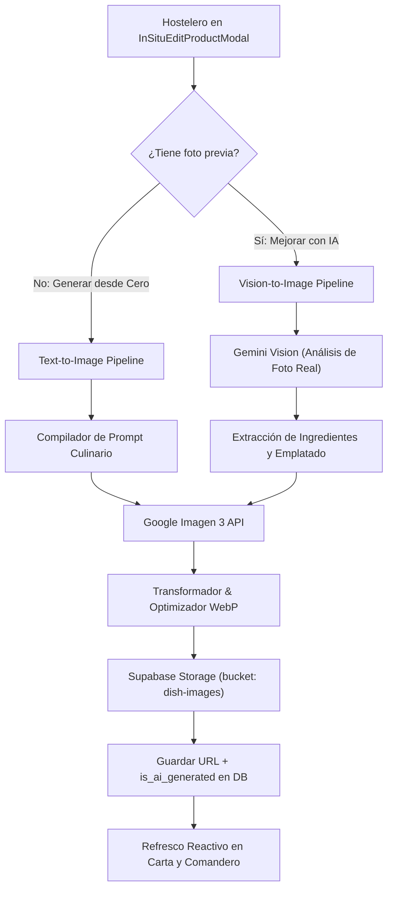

# Plan de Arquitectura: Generador y Mejorador de Fotos Gastronómicas con IA para Fluxo

## 1. Resumen Ejecutivo y Propósito
El objetivo de esta funcionalidad es eliminar una de las mayores barreras de entrada y retención de restaurantes en Fluxo: **la falta de fotografías profesionales o atractivas en su carta digital**.

Muchos hosteleros no disponen de presupuesto para contratar un fotógrafo gastronómico (300€ - 800€ por sesión), o toman fotos con el teléfono móvil en condiciones de mala iluminación, sombras duras o ángulos poco apetecibles. Siguiendo el benchmark validado en el mercado (ej. *Besmeo* a 24.99$/mes), Fluxo integrará esta capacidad de forma nativa e integrada en su **Plan Full (99€/mes)** con un cupo de 30 fotos mensuales de cortesía.

---

## 2. Modos de Operación

### Modo A: Generación Gastronómica desde Cero (Text-to-Image)
- **Caso de uso**: El hostelero añade un nuevo plato a la carta (ej. *Hamburguesa de vaca madurada con queso San Simón da Costa y cebolla caramelizada*) y no dispone de ninguna fotografía.
- **Flujo**:
  1. El sistema lee el nombre del plato, la categoría, la descripción/ingredientes y los alérgenos configurados en el formulario.
  2. El motor enriquece los datos con un **Prompt Maestro Gastronómico** preconfigurado (estilo culinario de estudio, iluminación difusa suave a 45°, vajilla rústica o moderna según el restaurante, profundidad de campo natural f/2.8, vapor tenue y texturas hiperrealistas).
  3. **Google Imagen 3** genera la imagen en alta resolución (1024x1024 o 4:3).
  4. Se convierte a WebP optimizado (~100-180 KB) y se sube automáticamente a Supabase Storage (`dish-images`).
  5. Se asocia la URL al plato con el flag `is_ai_generated: true`.

### Modo B: Mejora Profesional de Foto Existente / Foto de Móvil (Vision-to-Image)
- **Caso de uso**: El dueño cocina el plato, le saca una foto con su móvil en cocina o en la barra, pero la imagen se ve oscura, con brillo de flash o poco profesional.
- **Flujo**:
  1. El hostelero sube la foto tomada desde su dispositivo o la selecciona de la galería.
  2. **Gemini Vision (Multimodal)** analiza la fotografía y desglosa:
     - Ingredientes y guarniciones reales visibles.
     - Tipo de corte de la carne/pescado y nivel de cocción visible.
     - Salsa, puntos de emplatado y estilo de vajilla (plato hondo, pizarra, cerámica artesanal).
  3. Con esa especificación estructurada y respetando estrictamente la receta real del restaurante, se genera el prompt para **Imagen 3**, garantizando que la foto mejorada refleje el plato real y no una invención genérica.
  4. La imagen generada se previsualiza en el modal con un comparador antes/después ("Tu foto" vs "Versión estudio IA").
  5. Si el dueño aprueba, se guarda en Supabase Storage y se sustituye en la carta.

---

## 3. Arquitectura Técnica y Componentes

### 3.1. Flujo de Datos y Pipeline


### 3.2. Contrato de la API (`POST /api/admin/ai-photo`)
- **Autenticación**: Obligatoria mediante `verifyStaffRequest(req, slug)` (PIN de administrador/gerente).
- **Control de Cuota**: Consulta en base de datos el consumo mensual del restaurante (`ai_photos_used_this_month < 30`).
- **Payload de Entrada**:
```typescript
interface GeneratePhotoRequest {
  slug: string;
  mode: 'generate_scratch' | 'enhance_photo';
  dishName: string;
  categoryName?: string;
  description?: string;
  allergens?: string[];
  sourceImageBase64?: string; // Solo requerido en modo 'enhance_photo'
  aspectRatio?: '4:3' | '1:1';
}
```

- **Respuesta de Salida**:
```typescript
interface GeneratePhotoResponse {
  success: boolean;
  imageUrl: string;
  quotaRemaining: number;
  metadata: {
    model: string;
    is_ai_generated: true;
    aspectRatio: string;
    generatedAt: string;
  };
}
```

---

## 4. Prompt Engineering Culinario Maestro
Para evitar fotos plásticas, poco realistas o con vajillas imposibles, se utiliza una plantilla de prompt con restricciones estrictas:

```text
Professional culinary photography of [dishName], a traditional and gourmet gastronomic dish.
Ingredients and composition: [description / detected ingredients].
Plating: Artisanal restaurant presentation, served on authentic ceramic dishware, gourmet restaurant setting.
Lighting: Soft directional studio lighting at 45 degrees, natural bounce fill, realistic food textures, subtle glistening sauces, delicate steam rising.
Camera: 50mm macro lens, f/2.8 shallow depth of field, warm ambient tones, hyper-realistic, appetizing food presentation.
Negative Prompt: oversaturated colors, plastic appearance, fake CGI, cartoon, floating elements, text, watermark, hands, human faces, dirty background, distorted proportions.
```

---

## 5. Almacenamiento y Base de Datos

### 5.1. Supabase Storage
- **Bucket**: `dish-images` (Público para lectura en CDNs).
- **Ruta de archivo**: `/${restaurant_id}/${dish_id}_${timestamp}.webp`
- **MIME**: `image/webp` (calidad 85, ancho máx. 1200px para garantizar tiempos de carga < 200ms en redes móviles).

### 5.2. Esquema de Datos (`products` y `restaurants`)
- `products.image_url`: Almacena la URL pública final de Supabase Storage.
- `products.is_ai_generated`: Booleano (`true`/`false`) para control de transparencia.
- `restaurants.ai_photos_count_month`: Contador mensual de fotos generadas para control de cuota de 30 fotos del Plan Full.

---

## 6. Experiencia de Usuario (UI/UX)

### 6.1. En el Modal de Edición de Platos (`InSituEditProductModal.tsx`)
1. **Sección de Imagen Renovada**:
   - Selector visual con vista previa de la foto actual.
   - Dos botones de acción rápida con estética elegante Fluxo:
     - `✨ Generar con IA`: Abre el generador rápido basado en el nombre y descripción del plato.
     - `📸 Mejorar mi Foto`: Permite arrastrar o sacar una foto con el móvil para pasarla por el filtro de estudio.
   - Indicador de cuota disponible: `Cupo mensual: 24/30 fotos restantes (Plan Full)`.
   - Selector antes/después con opción de "Aceptar foto IA" o "Descartar".

### 6.2. En la Carta del Comensal (`/menu/[slug]/page.tsx`)
- En las tarjetas y ficha detallada de platos que tengan `is_ai_generated === true`:
  - Se añade una etiqueta sutil en la esquina superior de la foto:
    ```tsx
    <span className="absolute top-2 left-2 z-10 px-2 py-0.5 rounded-md bg-black/60 backdrop-blur-md text-[10px] text-white/90 font-medium flex items-center gap-1 shadow-sm border border-white/10">
      <Sparkles className="w-3 h-3 text-amber-300" /> Foto ilustrativa
    </span>
    ```
  - Proporciona transparencia legal (Directiva UE de Información al Consumidor) y genera confianza sin restar apetitosidad al plato.

---

## 7. Plan de Verificación y Criterios de Aceptación
1. **Generación desde Cero**: Comprobar que al introducir un plato sin foto y pulsar "Generar con IA", se produce una imagen apetecible en < 5 segundos, se optimiza a WebP y se guarda en Supabase Storage.
2. **Mejora de Foto de Móvil**: Comprobar que al subir una foto casera oscura, Gemini Vision detecta los ingredientes y genera una imagen fiel de alta cocina que conserva los elementos del plato.
3. **Persistencia & Zero Regressions**: Comprobar que el producto guarda la nueva URL tanto en base de datos como en la carta en tiempo real, sin alterar precios, alérgenos ni estados de comandas activas.
4. **Control de Cuota**: Verificar que una vez consumidas las 30 fotos mensuales de cortesía, el sistema informa al usuario sobre la renovación mensual del cupo.
5. **Calidad de Código**: `npx.cmd tsc --noEmit` con 0 errores y producción build limpia en Next.js 14.
